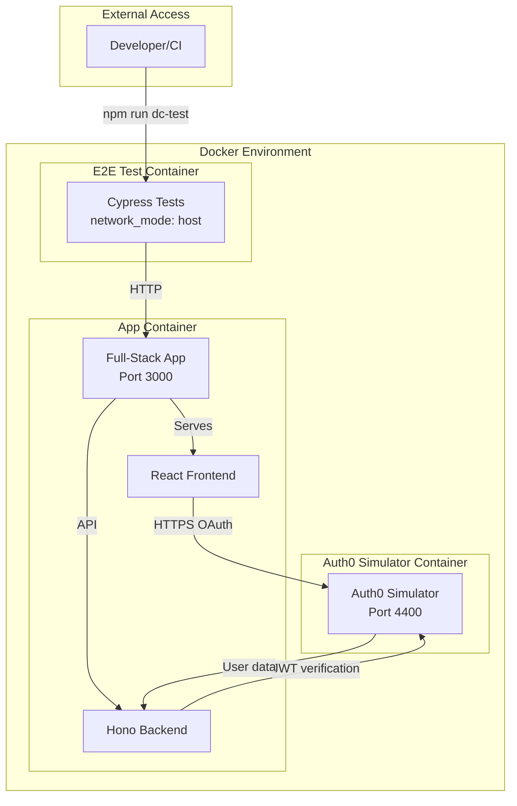
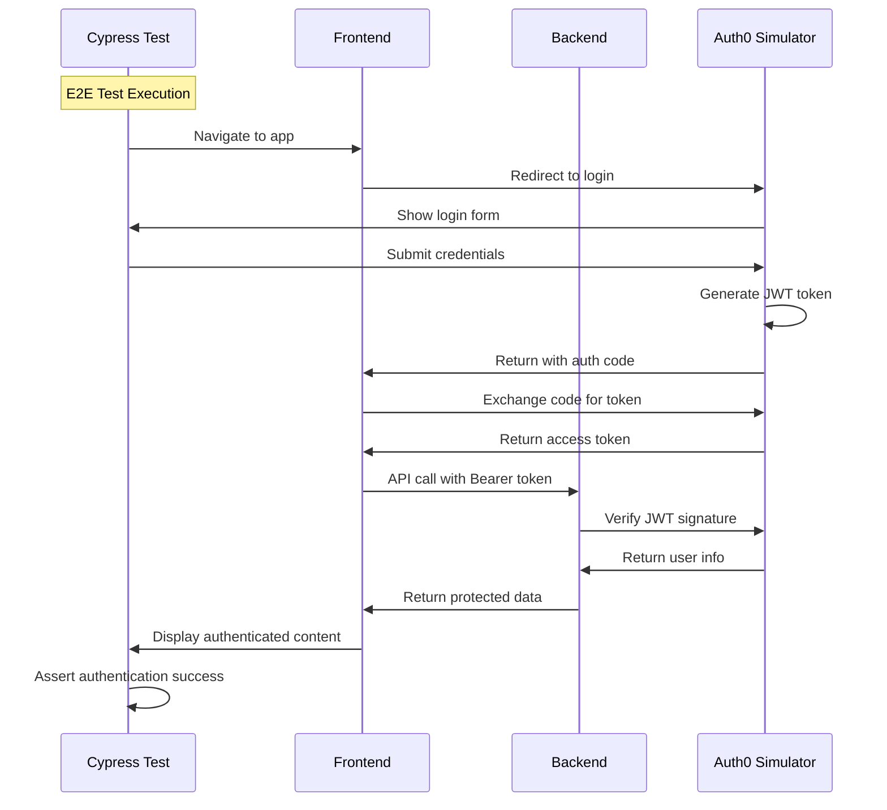
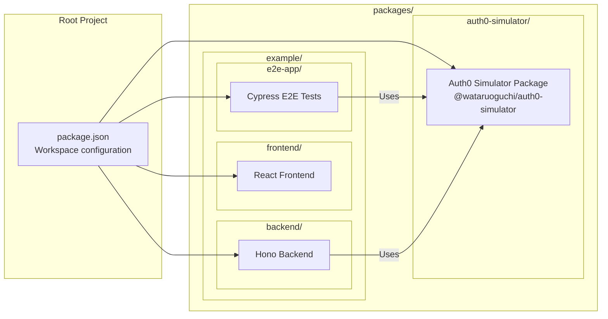

# E2E with Auth0 Simulator

## Package available

Please read [./packages/auth0-simulator/README.md](./packages/auth0-simulator/README.md) for the package infromation.

## Setup

Start the application:

```sh
docker-compose up -d
```

## Commands

### NPM Scripts

```sh
# Format code
npm run format

# Lint code
npm run lint

# Rebuild and start application
npm run dc-rebuild

# Run E2E tests
npm run dc-test

# Run E2E tests with custom ports
npm run dc-test:custom-ports

# Run unit tests across all packages
npm run test:unit

# Run all tests (unit + E2E)
npm run test
```

### Docker Compose Commands

```sh
# Start the application
docker-compose up -d

# Stop the application
docker-compose down

# View logs
docker-compose logs

# Rebuild and start
docker-compose up --build -d

# Run E2E tests
docker-compose up e2e

# Run with custom ports
APP_PORT=8080 AUTH0_PORT=8440 docker-compose up --build e2e
```

## E2E Testing

This project includes comprehensive E2E tests using Cypress and the Auth0 Simulator package:

- **Location**: `e2e-app/` directory
- **Framework**: Cypress with TypeScript
- **Auth0 Simulation**: Auth0 Simulator package for testing authentication flows
- **Docker Integration**: Tests run in Docker containers

### Running E2E Tests

```bash
# Run tests locally (requires app to be running)
cd e2e-app
npm install
npm run cypress:open  # Interactive mode
npm run test          # Headless mode

# Run tests with Docker
docker-compose up e2e
```

### Test Structure

- `cypress/e2e/` - Test files
- `cypress/support/` - Custom commands and configuration
- `cypress.config.cjs` - Cypress configuration

## Architecture Overview

This project demonstrates a complete E2E testing setup with Auth0 authentication simulation. Here's how the components work together:

### System Architecture



### Authentication Flow



### Package Structure



### Key Features

- **🔐 Auth0 Simulation**: Complete OAuth2/OpenID Connect flow simulation
- **🧪 E2E Testing**: Cypress tests with real authentication flows
- **🐳 Docker Integration**: All services containerized for consistency
- **📦 Monorepo Structure**: Organized packages with workspace management
- **🔧 Flexible Ports**: Configurable external ports without code changes
- **✅ Comprehensive Testing**: Unit tests for simulator + E2E tests for integration

## Port Configuration

This project supports flexible port configuration, allowing you to choose any available ports from outside the Docker network without modifying the `docker-compose.yml` file.

### Environment Variables

| Variable | Default | Description |
|----------|---------|-------------|
| `APP_PORT` | `3000` | External port for the main application |
| `AUTH0_PORT` | `4400` | External port for the Auth0 simulator |

### Usage Examples

You can try running E2E tests with the following ways:

#### Using Default Ports

```bash
docker-compose up --build e2e
```

- App: http://localhost:3000
- Auth0 Simulator: https://localhost:4400

#### Using Custom Ports

```bash
# Set environment variables
export APP_PORT=8080
export AUTH0_PORT=8440

# Or use inline
APP_PORT=8080 AUTH0_PORT=8440 docker-compose up --build e2e
```

- App: http://localhost:8080
- Auth0 Simulator: https://localhost:8440
