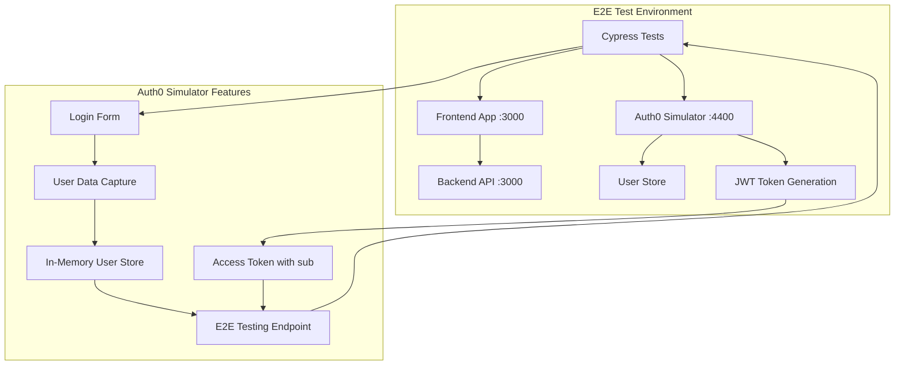
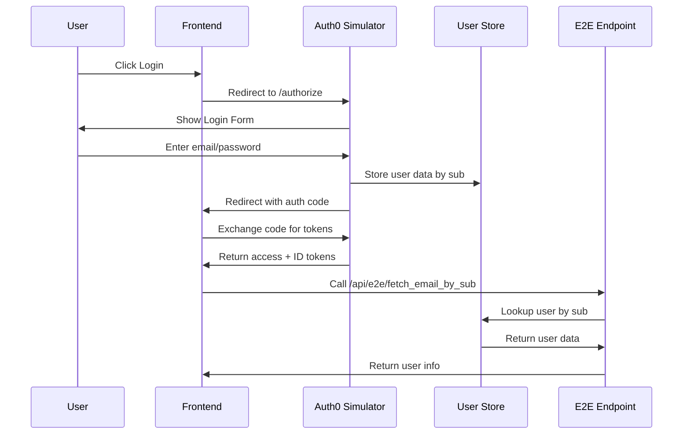
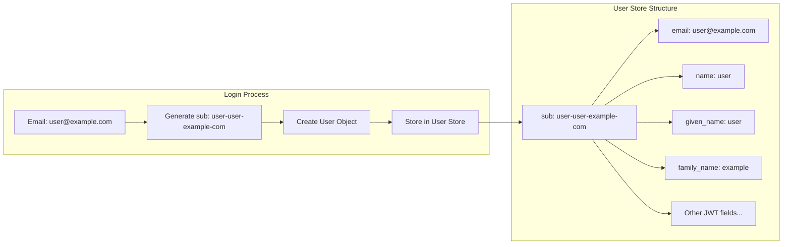
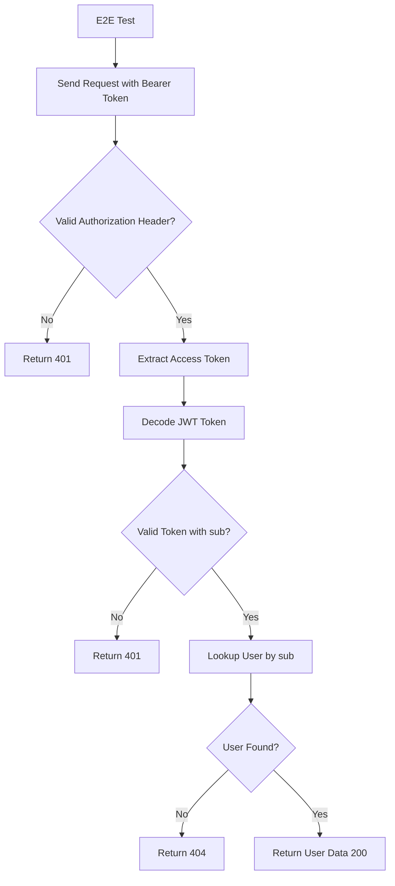
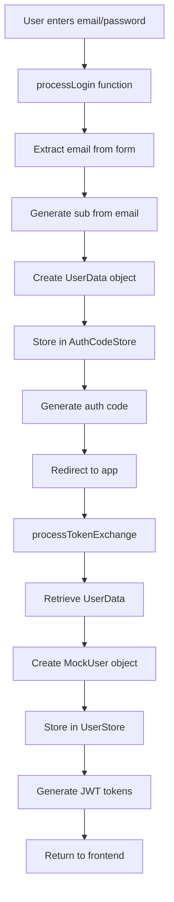

# E2E Tests with Auth0 Simulator

This directory contains end-to-end tests for the PoC E2E with Auth0 application using Cypress and a custom Auth0 Simulator that supports user data capture and retrieval.

## Architecture Overview



## Auth0 Simulator Specifications

### Core Features

The Auth0 Simulator provides a complete OAuth2/OpenID Connect simulation with the following capabilities:

1. **User Data Capture**: Captures email/password from login forms
2. **In-Memory User Store**: Stores user data by `sub` field for lookup
3. **JWT Token Generation**: Creates access and ID tokens with captured user data
4. **E2E Testing Endpoint**: Provides API to fetch user data by access token

### Authentication Flow



### User Data Storage



## E2E Testing Endpoint

### Endpoint Specification

**URL**: `GET /api/e2e/fetch_email_by_sub`

**Purpose**: Retrieve user information by access token's `sub` field for E2E testing

**Authentication**: Bearer token required (JWT signature verified with JWKS)

### Request Format

```http
GET /api/e2e/fetch_email_by_sub HTTP/1.1
Host: localhost:4400
Authorization: Bearer <access_token>
Content-Type: application/json
```

### Response Format

#### Success Response (200 OK)

```json
{
  "sub": "user-test-example-com",
  "email": "test@example.com",
  "name": "test",
  "given_name": "test",
  "family_name": "example",
  "picture": "https://via.placeholder.com/150",
  "aud": "test-client-id",
  "iss": "https://localhost:4400/",
  "azp": "test-client-id",
  "scope": "openid profile email offline_access"
}
```

#### Error Responses

| Status | Error | Description |
|--------|-------|-------------|
| 401 | `Missing or invalid authorization header` | No Authorization header or invalid format |
| 401 | `Invalid access token` | Token decode failed or missing `sub` |
| 404 | `User not found` | No user found for the given `sub` |
| 500 | `Failed to get user info` | Internal server error |

### API Flow Diagram



## Setup

### Local Development

1. Install dependencies:
```bash
npm install
```

2. Start the Auth0 simulator locally:
```bash
npm run simulator
```

3. Run Cypress tests:
```bash
# Open Cypress Test Runner
npm run cypress:open

# Run tests headlessly
npm run test

# Run tests with browser visible
npm run test:headed
```

### Docker Setup

The e2e tests can also be run using Docker Compose:

```bash
# Run all services including e2e tests
docker-compose up e2e

# Run only the Auth0 simulator
docker-compose up auth0-simulator

# Run tests against running services
docker-compose run e2e npm run test
```

## Test Structure

```
e2e/
├── cypress/
│   ├── e2e/           # Test files
│   ├── support/       # Custom commands and configuration
│   └── fixtures/      # Test data
├── src/
│   ├── auth0-simulator.ts    # Main simulator server
│   ├── auth-handlers.ts      # Authentication logic
│   ├── jwt-utils.ts          # JWT token utilities
│   ├── cert-utils.ts         # Certificate utilities
│   └── test/                 # Unit tests
│       ├── e2e-endpoint.test.ts
│       ├── auth-handlers.test.ts
│       ├── jwt-utils.test.ts
│       └── cert-utils.test.ts
└── package.json
```

## Auth0 Simulator Endpoints

| Endpoint | Method | Purpose |
|----------|--------|---------|
| `/` | GET | Health check |
| `/authorize` | GET | OAuth2 authorization endpoint |
| `/login` | POST | Login form processing |
| `/oauth/token` | POST | Token exchange |
| `/userinfo` | GET | Standard OAuth2 userinfo |
| `/api/e2e/fetch_email_by_sub` | GET | **E2E testing endpoint** |
| `/.well-known/openid_configuration` | GET | OpenID Connect discovery |
| `/.well-known/jwks.json` | GET | JSON Web Key Set |
| `/v2/logout` | GET | Logout endpoint |

## User Data Capture Process



## Test Commands

- `cy.login()` - Login with test user
- `cy.logout()` - Logout current user
- `cy.verifyApi()` - Test API endpoint

## Environment Variables

- `CYPRESS_baseUrl` - Base URL for the application (default: http://localhost:3000)
- `CYPRESS_AUTH0_DOMAIN` - Auth0 simulator domain (default: localhost:4400)

## Unit Testing

The project includes comprehensive unit tests for all components:

```bash
# Run all unit tests
npm run test:unit

# Run specific test file
npx vitest run src/test/e2e-endpoint.test.ts

# Run tests in watch mode
npx vitest
```

### Test Coverage

- **E2E Endpoint Tests**: 12 tests covering authentication, user lookup, error handling, and response format
- **Auth Handlers Tests**: 13 tests covering login, token exchange, and user creation
- **JWT Utils Tests**: 10 tests covering token generation and validation
- **Cert Utils Tests**: 11 tests covering certificate generation and JWKS creation

## Key Features

### 1. Dynamic User Data Capture
- Captures any email/password combination from login form
- Generates unique `sub` field from email address
- Stores user data in memory for later retrieval

### 2. E2E Testing Support
- Dedicated endpoint for testing user data retrieval
- **JWT signature verification with JWKS** (same as backend)
- Access token-based authentication
- Complete user information response

### 3. OAuth2/OpenID Connect Compliance
- Standard authorization flow
- JWT token generation with proper claims
- JWKS endpoint for token verification

### 4. Comprehensive Testing
- Unit tests for all components
- E2E tests with Cypress
- Error handling and edge case coverage
